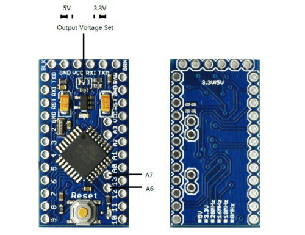

# Interfacing Arduino Pro Mini with USB FTDI adapter
These components have been bought of Ebay.

<b>Warning! Don't forget to setup the voltage from "USB FTDI adapter" to match the one from "Arduino Pro Mini". My "Arduino Pro Mini" has a voltage selector, which has been preset to 5V.</b>

---

<b>Boards:</b>

---

<b>Schematic:</b>

